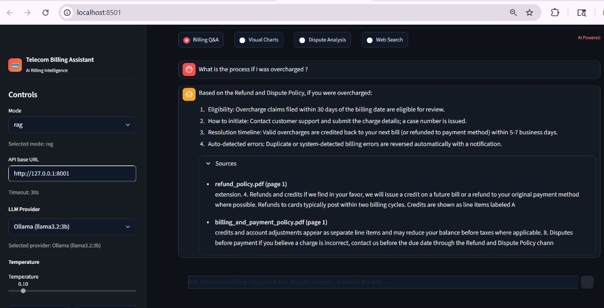
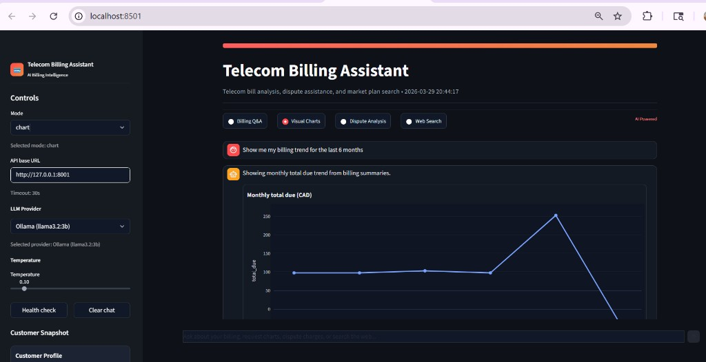
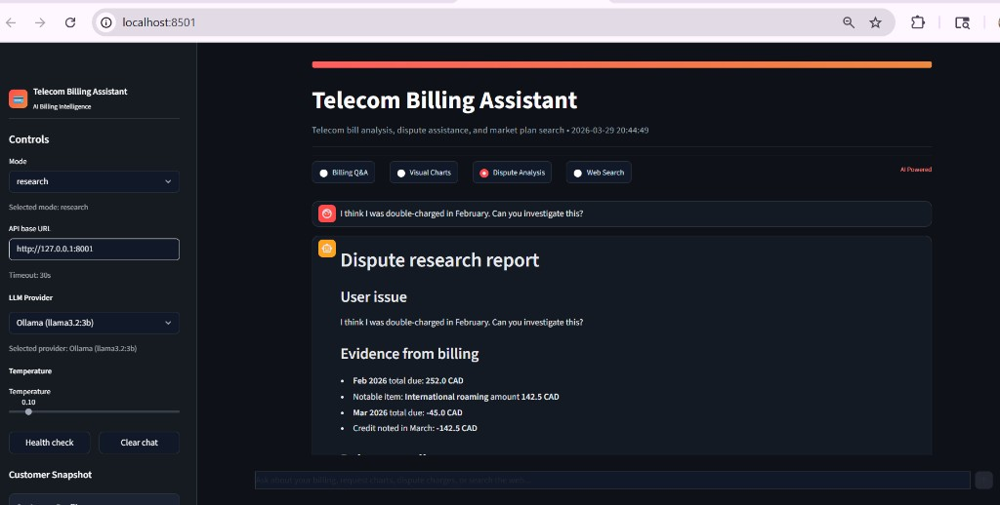
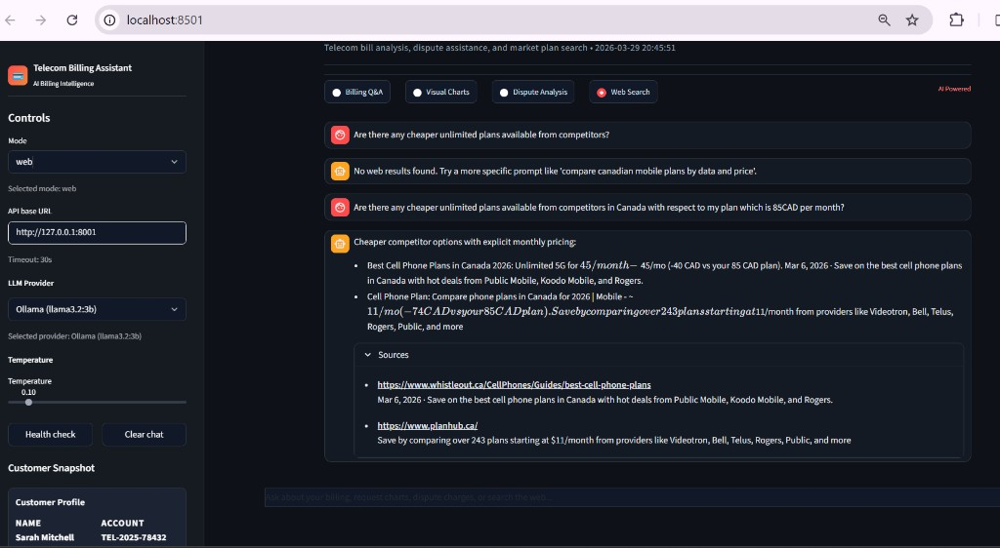

# Telecom Billing Assistant (Capstone)

> **Capstone Highlights:** Built an end-to-end AI telecom assistant with FastAPI + Streamlit, FAISS-based RAG over billing/policy PDFs, dispute research reporting, chart analytics, and relevance-filtered competitor plan search - focused on explainability, reliability, and demo-ready UX.

An **AI-assisted telecom billing demo**: answer questions from policy and bill PDFs (**RAG**), plot trends from structured billing data (**Plotly**), run **dispute-style research**, and use **web search** — with a **FastAPI** backend and **Streamlit** UI. All customer names, carriers, and amounts are **synthetic**.

**Repository folder:** `capstone-telecom-billing-assistant`

**Application plan (single source of truth):** [Telecom_Billing_Assistant_app_plan_FastAPI.md](Telecom_Billing_Assistant_app_plan_FastAPI.md) — architecture, API routes, dataset conventions (§8), and implementation phases (§12). There is no separate “alternate” plan document in this repo.

---

## Status

| Phase | Scope | Status |
|-------|--------|--------|
| **1 — Data** | Synthetic policy + billing PDFs, per-PDF `*_summary.json`, generator script | **Done** |
| **2 — App** | `core/`, FastAPI (`deploy/server.py`), Streamlit (`app.py`), FAISS from PDFs, Ollama + optional OpenAI-compatible API | **Done (v1 complete)** |

---

## Capstone Achievements

- Built a full **FastAPI + Streamlit** application with four production-style assistant flows: **Billing Q&A**, **Visual Charts**, **Dispute Analysis**, **Web Search**.
- Implemented **FAISS semantic retrieval** over policy and billing PDFs with query-aware reranking and deduped citations.
- Delivered a polished, mockup-aligned UI with stable tab behavior, per-tab conversation memory, and source expansion.
- Added deterministic **dispute research reporting** that correlates billing anomalies with policy evidence.
- Hardened web search with retry logic, telecom relevance filtering, and price-aware ranking near the customer plan.
- Maintained dataset consistency through one generator script for PDFs + JSON summaries.

---

## Learning Outcomes (What this capstone demonstrates)

- **RAG engineering:** moving from keyword retrieval to vector search with traceable evidence.
- **AI product architecture:** clear separation between API orchestration and UI presentation.
- **Data modeling for AI apps:** mixing unstructured PDF knowledge with structured JSON analytics.
- **Reliability/debugging:** handling stateful UI edge cases, intent-routing quality, and endpoint failures.
- **Prompting + deterministic controls:** combining model outputs with rule-based ranking for safer user responses.
- **Demo-readiness mindset:** iterating from prototype behavior to user-trust-worthy experience.

---

## What’s in this repo (today)

- **`data/policies/`** — Four NovaTel-style policy PDFs + matching `*_summary.json` (billing & payment; refund & dispute; roaming & international; plan & fair usage).
- **`data/billing/`** — Six monthly statements (Oct 2025 → Mar 2026) + `*_summary.json`, plus optional **`billing_rollup.json`**. The story includes a **Feb roaming spike** and a **Mar billing credit** for demos.
- **`scripts/generate_data.py`** — Single source of truth: regenerates every PDF and JSON so numbers stay aligned.
- **Application plan:** [Telecom_Billing_Assistant_app_plan_FastAPI.md](Telecom_Billing_Assistant_app_plan_FastAPI.md) — full build spec.
- **UI mockup:** [Telecom_Billing_Assistant_ui_mockup.html](Telecom_Billing_Assistant_ui_mockup.html) — static HTML reference (not the live app).

---

## Quick start (Phase 1 — regenerate data)

Python 3.10+ recommended.

```bash
cd capstone-telecom-billing-assistant
pip install -r requirements.txt
python scripts/generate_data.py
```

This writes:

- `data/policies/` — 4 PDFs + 4 `*_summary.json`
- `data/billing/` — 6 PDFs + 6 `*_summary.json` + `billing_rollup.json`

---

## Architecture (Implemented v1)

- **FastAPI** — Routes such as `/health`, `/v1/rag/query`, `/v1/chart`, `/v1/research`, `/v1/web/search`, `/v1/intent` (see plan §5).
- **Streamlit** — UI only; calls the API over HTTP (stateless `messages[]` recommended in plan §10).
- **RAG** — FAISS index built from policy + billing PDFs; charts read **`billing/*_summary.json`**, not re-parsed PDF text (plan §8).

Full layout, API contract, and checklist: **[Telecom_Billing_Assistant_app_plan_FastAPI.md](Telecom_Billing_Assistant_app_plan_FastAPI.md)** (same document as above).

---

## Key Dependencies (v1)

| Package | Purpose |
|---------|---------|
| `fpdf2` | Generate synthetic PDFs in `generate_data.py` |
| `fastapi`, `uvicorn` | API server and local development runtime |
| `streamlit`, `httpx` | UI client and API communication |
| `plotly` | Billing chart visualizations |
| `duckduckgo-search` | External market-plan lookup |
| `langchain`, `langchain-community` | Document loading/chunking orchestration |
| `langchain-ollama`, `langchain-openai` | Embedding provider integrations |
| `faiss-cpu` | Vector index and semantic retrieval |
| `pypdf` | PDF processing support |

---

## Git

This repo includes a **`.gitignore`** for Python, virtualenvs, `.env`, IDE files, and future index artifacts.

Initialize and make your first commit when ready:

```bash
cd capstone-telecom-billing-assistant
git init
git add -A
git status   # review
git commit -m "Phase 1: synthetic data, generator script, application plan, README"
```

---

## Runbook (Demo Day)

Start in this order:

1. **Ollama** (Terminal 1):
   - `ollama serve`
2. **FastAPI** (Terminal 2):
   - `uvicorn deploy.server:app --host 127.0.0.1 --port 8001 --reload`
3. **Streamlit** (Terminal 3):
   - `streamlit run app.py --server.port 8501`

Open:

- UI: `http://localhost:8501`
- API docs: `http://127.0.0.1:8001/docs`

---

## UI Screenshots

### Billing Q&A



### Visual Charts



### Dispute Analysis



### Web Search



---

## Disclaimer

Content is **fictional** and for **education / demonstration** only. It does not represent any real carrier’s policies or bills.
