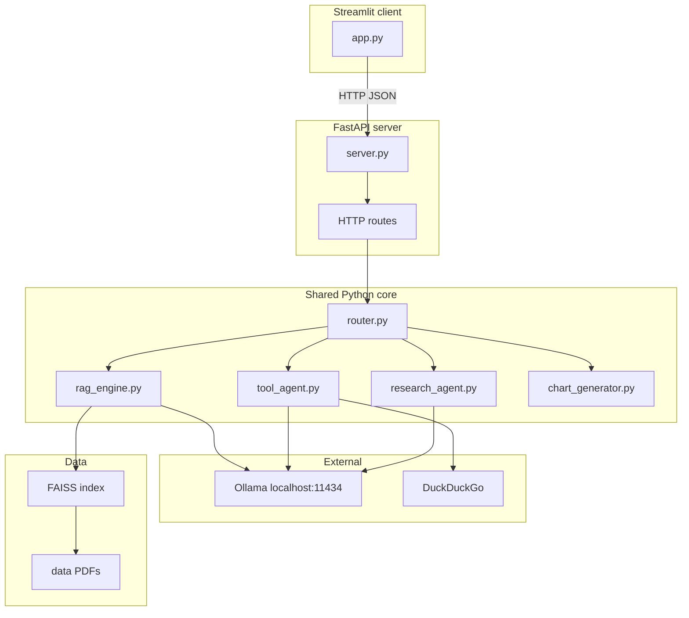

# Telecom Billing Assistant — Application Plan (FastAPI + Streamlit)

This document is the **canonical application plan** for this repo: a **FastAPI** application server plus a **Streamlit** UI client (aligned with a FastAPI + separate chat surface).

**UI mockup (HTML):** [Telecom_Billing_Assistant_ui_mockup.html](Telecom_Billing_Assistant_ui_mockup.html)

---

## 1. Why FastAPI + Streamlit

- **Clear API boundary** — You can demo the assistant with **curl**, **Postman**, or **Streamlit**; the same backend can be documented as a REST API in your capstone.
- **Project 4 alignment** — Matches “application server (FastAPI) + UI client” narrative from the course.
- **Separation of concerns** — `core/` is invoked by FastAPI; Streamlit only handles layout, session state, and HTTP calls.

**Tradeoff:** Two processes on demo day (API + UI) and slightly more glue code than a single Streamlit app.

---

## 2. Mapping to course projects (P1–P5)

Same capabilities as the capstone scope: RAG, DuckDuckGo tool agent, deep research / dispute flow, router, Plotly charts. **Implementation lives in `core/`** and is **mounted under FastAPI routes**; Streamlit does not import `core` directly (or imports only shared types).

---

## 3. Telecom Billing Assistant - Architecture



**Third process:** Ollama (`ollama serve`) — same as in all local LLM flows.

---

## 4. Planned repository layout (FastAPI variant)

```
capstone-telecom-billing-assistant/
    Telecom_Billing_Assistant_app_plan_FastAPI.md   # application plan (this document)
    Telecom_Billing_Assistant_ui_mockup.html
    app.py                           # Streamlit: UI only; calls API via httpx
    deploy/
        server.py                    # FastAPI app: mounts routes, starts lifespan (load index)
        __init__.py                # optional
    core/
        __init__.py
        llm_provider.py
        rag_engine.py
        tool_agent.py
        research_agent.py
        chart_generator.py
        router.py
        models.py                    # optional: Pydantic request/response models shared by API
    data/
        billing/                 # synthetic bill PDFs + one *_summary.json per PDF
        policies/                # synthetic policy PDFs + one *_summary.json per PDF
    scripts/
        generate_data.py         # generates all PDFs + all summary JSONs (single source of truth)
    config.py
    .env.example
    requirements.txt
    environment.yaml
```

**Naming note:** If you prefer, rename `app.py` to `streamlit_app.py` and document `streamlit run streamlit_app.py` — keep one entry point name consistent in README.

---

## 5. API surface — **multiple POSTs** (chosen)

**Decision:** Use **several explicit routes** (not a single mega-`/chat` endpoint), unless we add a thin **optional** orchestrator later. This matches REST-style testing (Swagger/Postman per capability) and your preference.

**Why not one POST only?** A single `POST /v1/chat` is slightly less code but hides capabilities behind one body shape. **Multiple POSTs** add a few routes to maintain; the only real “cost” is the UI must know **which** endpoint to call — solved by **`POST /v1/intent`** (classify user message → intent label) then the client calls the matching route, **or** by mode tabs in the UI (mockup already has tab-like flows). No technical blocker.

| Method | Path | Purpose |
|--------|------|---------|
| `GET` | `/health` | Liveness + optional `dependencies_ok` (Ollama ping). |
| `POST` | `/v1/intent` | `{ "message": "..." }` → `{ "intent": "rag" \| "chart" \| "research" \| "web" }` (optional if UI uses explicit modes). |
| `POST` | `/v1/rag/query` | Grounded Q&A over PDFs; response includes `text`, `sources[]`. |
| `POST` | `/v1/chart` | Chart request (e.g. trend, breakdown); response includes `plotly_json` or `chart_spec`. Reads structured **`billing/*_summary.json`** (see §8). |
| `POST` | `/v1/research` | Dispute / deep-research report (longer latency); response `markdown` + optional sections. |
| `POST` | `/v1/web/search` | DuckDuckGo-backed answer; response `text`, `sources[]` (URLs/snippets). |
| `POST` | `/v1/index/rebuild` | Rebuild FAISS from `data/` PDFs. |

Shared request fields (all POSTs that need dialog): **`messages`** (see §7) — array of `{ "role": "user"\|"assistant", "content": "..." }` for last *N* turns, plus **`message`** for the latest user text where convenient.

**Charts:** Return **Plotly JSON** (`fig.to_json()`) or a small **chart_spec**; avoid huge base64 unless needed.

**CORS:** Enable for `http://localhost:8501` if anything calls the API from the browser; Streamlit server-side `httpx` often does not need it.

---

## 6. Streamlit client responsibilities

- Sidebar: LLM provider, temperature, customer card (static or from config), **API base URL** (`http://127.0.0.1:8001`), “Rebuild index” → `POST /v1/index/rebuild`.
- Chat: `st.chat_message` / `st.chat_input`; on submit:
  - **Option A:** `POST /v1/intent` then `httpx.post` to `/v1/rag/query` | `/v1/chart` | `/v1/research` | `/v1/web/search` with shared **`messages`** payload; **or**
  - **Option B:** User picks mode (tabs / radio) matching the mockup demo tabs → call the corresponding endpoint directly (no classify call).
- Render: markdown for text, `st.plotly_chart` when response includes Plotly JSON, expandable “Sources” for citations.
- **Health:** On load, `GET /health`; show “API disconnected” banner if failure (see §11).

**Configuration:** `API_BASE_URL` in `.env` or `st.secrets`, default `http://127.0.0.1:8001`.

---

## 7. Local run (two terminals)

**Prerequisite:** Ollama running (`ollama serve`), models pulled.

**Terminal 1 — API**

```powershell
cd "c:\Telus_Billing\Study\Study2026\BecomeAnAIEngineer_Solutions\capstone-telecom-billing-assistant"
# activate venv/conda first
uvicorn deploy.server:app --host 0.0.0.0 --port 8001 --reload
```

**Terminal 2 — Streamlit**

```powershell
cd "c:\Telus_Billing\Study\Study2026\BecomeAnAIEngineer_Solutions\capstone-telecom-billing-assistant"
streamlit run app.py --server.port 8501
```

**Browser:** `http://localhost:8501` (UI). **API docs:** `http://127.0.0.1:8001/docs` (OpenAPI).

**Optional:** `curl` or Postman against each `/v1/...` route for the “API demo” slide.

---

## 8. Dataset, PDFs, and **per-document `*_summary.json`**

**Agreed:** For **every** synthetic PDF (billing **and** policy), generate a **companion JSON** next to it (same basename), e.g.:

- `data/billing/billing_2025_10.pdf` → `data/billing/billing_2025_10_summary.json`
- `data/policies/refund_policy.pdf` → `data/policies/refund_policy_summary.json`

`scripts/generate_data.py` is the **single generator** for PDFs + JSONs so numbers and narrative stay consistent.

### 8.1 Billing `*_summary.json` (structured for charts + APIs)

Use for **Plotly** (totals by month, categories, dispute math) and optional validation. Example shape (fields can be refined in implementation):

```json
{
  "document_type": "billing_statement",
  "source_pdf": "billing_2025_10.pdf",
  "period": { "label": "Oct 2025", "start": "2025-10-01", "end": "2025-10-31" },
  "account": { "id": "TEL-2025-78432", "customer_name": "Sarah Mitchell" },
  "plan": { "name": "Unlimited Plus", "monthly_charge": 85.0, "currency": "CAD" },
  "line_items": [
    { "category": "base_plan", "description": "Unlimited Plus", "amount": 85.0 },
    { "category": "taxes_fees", "description": "GST/HST and regulatory", "amount": 12.5 }
  ],
  "totals": { "subtotal": 97.5, "taxes": 0.0, "total_due": 97.5, "currency": "CAD" },
  "notes": ["Normal month — no roaming."]
}
```

Charts read **only** from these files (or a merged `billing_rollup.json` if we add one later) — **not** from re-parsing PDF text.

### 8.2 Policy `*_summary.json` (metadata + discovery; RAG still uses full PDF)

Policy summaries are **not** a substitute for chunking the PDF for RAG. They provide:

- Stable **title**, **topics[]**, **effective_date**, **page_count**, **short_description**
- Optional **section_headings[]** for UI “document cards” or debugging

Example:

```json
{
  "document_type": "policy",
  "source_pdf": "refund_policy.pdf",
  "title": "Refund and Dispute Policy",
  "topics": ["refunds", "overcharges", "timelines"],
  "effective_date": "2025-01-01",
  "page_count": 6,
  "short_description": "Rules for refunds, credits, and billing disputes."
}
```

### 8.3 LLM / tools (unchanged)

**DuckDuckGo** (no Tavily in v1), Ollama + optional OpenAI-compatible API, Plotly for visuals. FAISS built from **policy + billing PDFs**; **load index in FastAPI lifespan** or lazy-load on first request.

### 8.4 Production note — why not `*_summary.json` for every real user?

In **live products**, you rarely keep a hand-authored JSON next to every PDF for every user. **Recurring billing analysis** usually reads **structured data from billing systems, warehouses, or APIs** (the PDF is often just a customer-facing render). **Ad-hoc uploads** use **extraction pipelines** (parsers, OCR, or LLM-assisted extraction) and sometimes validation — not a pre-generated sidecar file.

**For this capstone**, per-PDF `*_summary.json` is still the **right tradeoff**: it **simulates** “structured truth aligned with the PDF,” gives **reliable charts**, and avoids brittle demo-time PDF table parsing. In a report or defense, state explicitly that production would swap sidecar files for **API/ETL-sourced** or **on-ingest extracted** structured data.

---

## 9. Demo-day flow (FastAPI-aware)

1. Start Ollama; start **uvicorn**; confirm `/health` or `/docs`.
2. Start **Streamlit**; confirm UI shows “API connected” (health check).
3. Walk through RAG, charts, dispute research, web search **via the UI** (same capstone user story).
4. **Optional:** Show **Swagger UI** (`/docs`) or **curl** examples for `/v1/rag/query`, `/v1/chart`, etc.

---

## 10. Conversation state — **recommended approach**

**Recommendation for v1:** **Stateless API** — each `POST` body includes a **`messages`** array: the last **N** turns (e.g. 10–20 messages or a token budget). The server does **not** store conversation history in memory between requests.

**Why:**

- Works with `--reload` and multiple workers; no leaked RAM on long demos.
- Easy to reason about and test (each request is self-contained).
- Streamlit keeps `st.session_state["messages"]` and sends the slice to FastAPI on every submit.

**Not recommended for v1:** Server-side `session_id` → in-memory dict (lost on restart; scaling quirks) or Redis (extra dependency) unless you outgrow the above.

---

## 11. Pre-implementation checklist (updated)

1. **Per-document `*_summary.json`** — **Agreed:** one JSON per billing PDF and per policy PDF, generated with `generate_data.py` (§8). Charts and validations use billing JSONs; RAG still indexes full PDFs.

2. **API contract** — **Agreed:** **multiple POSTs** (§5). Freeze Pydantic models per route (`RagRequest`, `ChartRequest`, …) before wiring Streamlit.

3. **Conversation** — **Agreed:** **stateless** + `messages[]` in body (§10).

4. **Secrets & config** — `.env.example`; no auth on localhost for capstone.

5. **Failure modes & resilience (in scope for implementation)** — Explicit handling for:

   - **Ollama** unreachable or slow → HTTP 503 / structured error; Streamlit shows clear message (“Start Ollama and pull the model”).
   - **FastAPI** down → `GET /health` fails; Streamlit banner + disable send.
   - **httpx** timeouts on every outbound call (configurable seconds).
   - **DuckDuckGo** empty / rate-limited → user-visible message; optional retry once.
   - **RAG** empty retrieval → “I could not find that in the documents” (no hallucinated citations).
   - **Long `/v1/research`** → timeout or streaming later; v1 can use a generous timeout + “still working” in UI.

6. **Models pinned** — README lists exact Ollama tags.

7. **Runbook** — README: env, `ollama pull`, data generation, start order, ports.

8. **Smoke tests (optional)** — `/health` + one happy-path per route with mocks where needed.

9. **Windows paths** — `pathlib` throughout.

---

## 12. Implementation phases (**order of work**)

**Phase 1 — Data (first)**  

1. Implement / run **`scripts/generate_data.py`** to create:
   - Synthetic **billing PDFs** (6 months) under `data/billing/`
   - Synthetic **policy PDFs** under `data/policies/`
   - Matching **`*_summary.json`** for each PDF (§8)  
2. Manual spot-check: open a few PDFs + JSONs for consistency (Feb anomaly, Mar credit story).

**Phase 2 — Application**  

3. `core/` modules (LLM, RAG, FAISS build, tools, research, charts, router).  
4. `deploy/server.py` with routes from §5 + error handling from §11.  
5. `app.py` (Streamlit) + `.env.example` + README.  
6. Optional pytest smoke tests.

This order is **intentional:** no duplicate data work after code exists, and charts stay aligned with PDFs from day one.

### 12.1 Dataset file creation order (detailed)

Use **`scripts/generate_data.py`** to emit everything in one run; the list below is the **logical order** to implement inside that script (or to validate outputs manually). **FAISS / index files are not dataset files** — they are built in Phase 2 from these PDFs.

| Step | What to create | Notes |
|------|----------------|--------|
| 0 | Create empty dirs: `data/policies/`, `data/billing/` | — |
| 1 | `data/policies/<name>.pdf` + `data/policies/<name>_summary.json` | Repeat for **each** policy doc (e.g. billing & payment; refund & dispute; roaming & international; plan & fair usage). **Pair first:** write JSON from the same source of truth you use to render the PDF text so titles/topics match. |
| 2 | `data/billing/<name>.pdf` + `data/billing/<name>_summary.json` | Repeat for **each month** in **chronological order** (recommended: Oct → Nov → Dec → Jan → Feb → Mar) so the Feb anomaly and Mar credit narrative stays consistent when you review files in order. |
| 3 | *(Optional)* `data/billing/billing_rollup.json` | Single file aggregating monthly totals for quick chart loads — **optional** if every chart reads per-month `*_summary.json` only. |

**Within each step:** for every PDF, create the **companion `*_summary.json` immediately** after (or generate both from one internal dict) so filenames and amounts never drift.

**Not part of Phase 1 dataset files:** `faiss_index/` (or LangChain `save_local` output) — created when the app first indexes PDFs or when **Rebuild index** runs.

---

## 13. Changelog

| Date | Note |
|------|------|
| 2026-03-25 | Initial **FastAPI + Streamlit** plan (this document). |
| 2026-03-25 | Removed alternate `Telecom_Billing_Assistant_app_plan.md`; this file is the single plan document. |
| 2026-03-25 | Added §10 pre-implementation checklist (structured chart data, API contract, sessions, secrets, failures, models, README, tests, paths). |
| 2026-03-25 | Per-document `*_summary.json` for billing + policy; **multiple POSTs** as chosen API; **stateless `messages`** recommended; §12 implementation phases (data first); expanded **error handling** scope (§11). |
| 2026-03-25 | Added §8.4 production note: sidecar JSON as capstone simulation vs APIs/ETL/extraction in live systems. |
| 2026-03-25 | Added §12.1 dataset file creation order (dirs → policy pairs → billing pairs by month; optional rollup; FAISS not Phase 1). |
